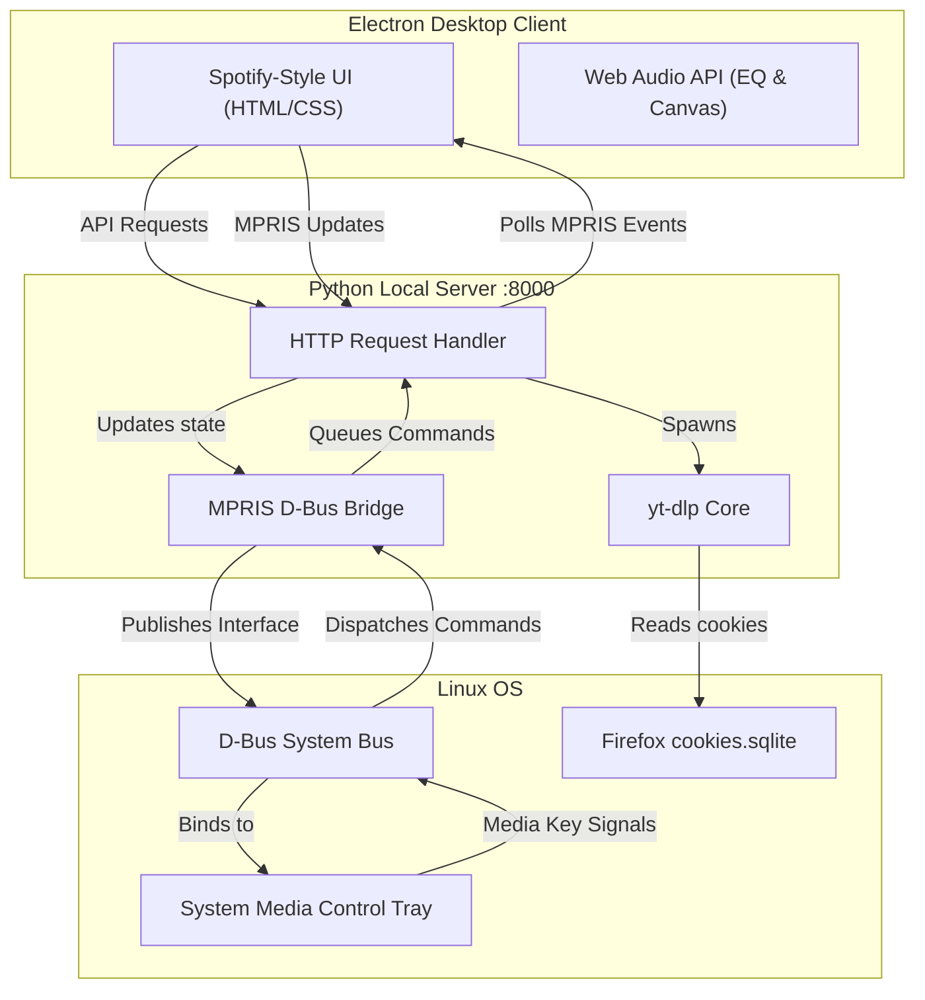

# 🎵 VibeTube — Spotify-Style YouTube & SoundCloud Player for Linux

<div align="center">

[](https://opensource.org/licenses/MIT)
[](https://www.electronjs.org/)
[](https://www.python.org/)
[](#)
[](#)

**A desktop YouTube & SoundCloud audio player built with Electron and Python, designed for Linux with a native D-Bus MPRIS bridge, 7 beat-reactive canvas visualizers, and a 7-band graphic equalizer modal wrapped in a premium Spotify-inspired dark UI.**

[🇺🇦 Читати опис українською](#-vibetube--youtube--soundcloud-плеєр-у-стилі-spotify)

</div>

---

## 🚀 Key Features

* **🎨 Spotify Aesthetic:** Features a dark matte canvas, rounded square artwork, clean hover overlays, glowing highlights, and custom capsule tab controls.
* **🧠 Smart Shorts Filtering (Anti-Shorts):** Automatically filters out vertical clips, meme videos, and YouTube Shorts (videos under 60 seconds or containing `/shorts/` in their URL) to keep your library clean.
* **🎛️ Graphic Equalizer Modal:** 
  * 7-band fine equalizer (60Hz to 15kHz) with persistent gains storage.
  * Presets selector: `Flat`, `Bass Boost`, `Vocal Boost`, `Pop`, `Rock`, `Jazz`, `Electronic`.
  * Advanced effects: Reverb depth control, playback speed slider, and quick presets (**Nightcore** & **Slowed & Reverb**).
* **📊 Beat-Reactive Visualizers:** 7 dynamic visualizers (Bars, Wave, Spikes, Spectrum, Decibels, Battery, Particle). The main visualizer container shadow, background aura, and square album artwork pulse and scale in real-time to the audio's bass frequencies.
* **🐧 Native Linux System Integration (MPRIS):**
  * Fully integrated with the Linux system tray media controls (GNOME, KDE Plasma, XFCE).
  * **Local Album Art Cache:** Automatically downloads remote thumbnails, saves them locally to `.cache/`, and updates MPRIS using `file://` URIs, forcing Linux notifications and lock screen widgets to render the covers correctly.
  * Native media keys (Play/Pause, Next, Previous, Volume, Stop) are fully bound through D-Bus properties.
* **📂 Firefox Library Sync:** Directly queries Firefox SQLite cookies databases to automatically synchronize your YouTube search history, playlists, liked tracks, and history on startup.

---

## 🏗️ System Architecture

VibeTube splits its tasks between a native Electron desktop client and a Python local server to provide maximum performance:



---

## 🛠️ Project Structure

```
youtube-player/
├── main.js                  # Electron application entry point
├── index.html               # Main window layout and modal overlay
├── index.css                # Spotify dark color system and animations
├── index.js                 # Web Audio, visualizers, and state handlers
├── youtube_player_server.py # Python local server and D-Bus MPRIS bridge
├── .gitignore               # Config to skip cache, dependencies, and logs
├── LICENSE                  # MIT License details
└── README.md                # Project documentation
```

---

## 📦 Installation & Setup

### Prerequisites
Make sure you have the following installed on your system:
* **Node.js** (v16+)
* **Python 3**
* **yt-dlp** (globally available in your system path)
* **Firefox** (for automatic cookies database synchronization)

### Step 1: Clone the repository
```bash
git clone https://github.com/yourusername/youtube-player.git
cd youtube-player
```

### Step 2: Install Node.js dependencies
```bash
npm install
```

### Step 3: Install Python system dependencies
Install the required D-Bus bindings for Python:
```bash
pip install pydbus
```
> [!NOTE]
> For `pydbus` to work, your system must have PyGObject dependencies installed (e.g., `python3-gi`, `gobject-introspection` on Fedora/Arch/Ubuntu).

### Step 4: Run the Application
Start the Electron wrapper and local server:
```bash
npm start
```

---

## 🤝 Contributing & Support

If you like this project, please consider giving it a ⭐ **Star** on GitHub to show your support! 

Pull requests are welcome. For major changes, please open an issue first to discuss what you would like to change.

---

<br>

# 🇺🇦 VibeTube — YouTube & SoundCloud плеєр у стилі Spotify

**VibeTube** — це сучасний десктопний аудіоплеєр, що працює на базі **Electron** (фронтенд) та **Python** (бекенд). Інтерфейс додатка повністю адаптований під дизайн-систему Spotify (темні кольори, обкладинки, повзунки та смуга прокручування), інтегрований у системне меню Linux та містить потужний еквалайзер і інтерактивні візуалізатори.

## 🌟 Основні переваги
* **🎨 Spotify Дизайн:** Темні матові фони, круглі кнопки-пігулки вкладників, квадратна обкладинка треку з округленням кутів.
* **🧠 Смарт-фільтр YouTube Shorts:** Автоматично приховує відео коротше 60 секунд або з посиланнями `/shorts/`.
* **🎛️ Еквалайзер у модальному вікні:** 7-смуговий еквалайзер, пресети, контроль Bass Boost та Reverb, ефекти Nightcore / Slowed & Reverb.
* **📊 Реактивний візуалізатор:** 7 режимів відображення; обкладинка та світіння вікна динамічно пульсують і змінюють розміри в такт низьким частотам.
* **🐧 Повна Linux-інтеграція (MPRIS):**
  * Підтримка медіаклавіш системи та системного трею.
  * **Локальний кеш обкладинок:** Сервер скачує прев'ю у `.cache/current_art.jpg` та підключає їх до MPRIS за протоколом `file://`, що забезпечує 100% відображення обкладинок у сповіщеннях та на екрані блокування Linux.

## 🚀 Запуск додатка
1. Встановіть залежності:
   ```bash
   npm install
   pip install pydbus
   ```
2. Запустіть додаток:
   ```bash
   npm start
   ```
